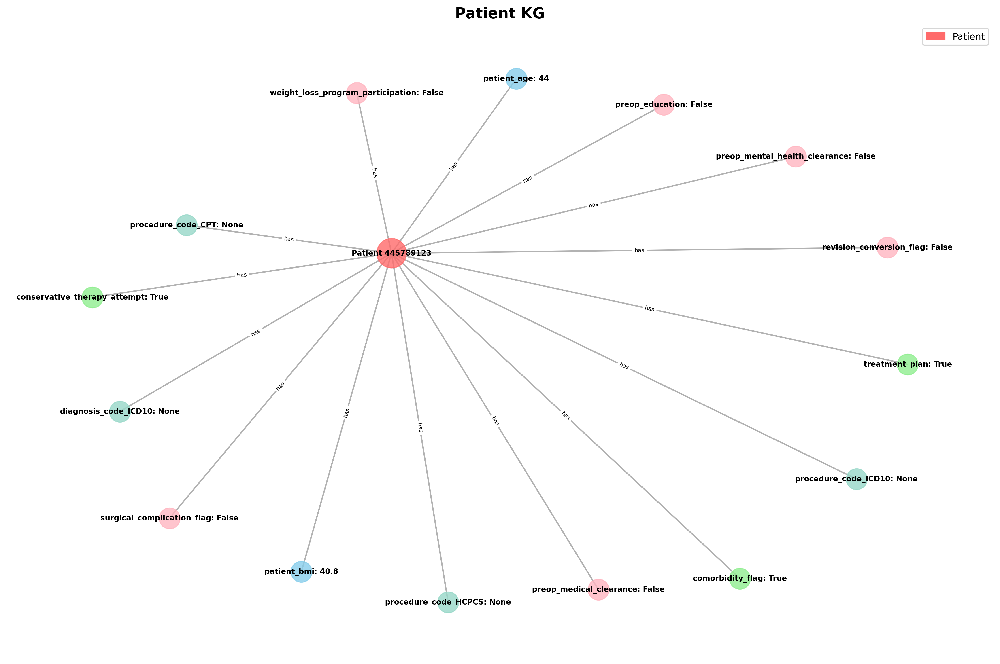
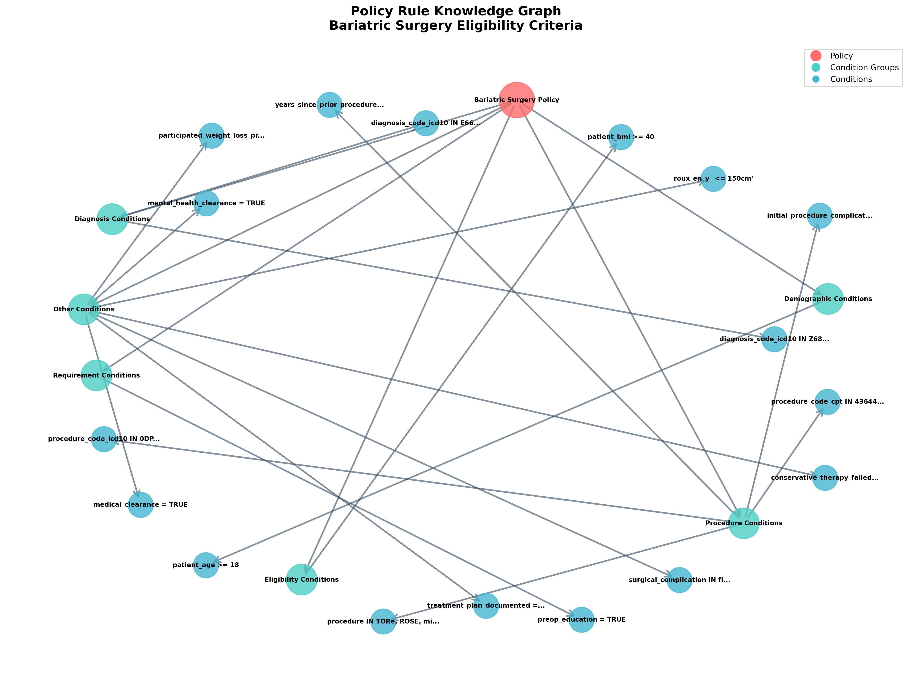
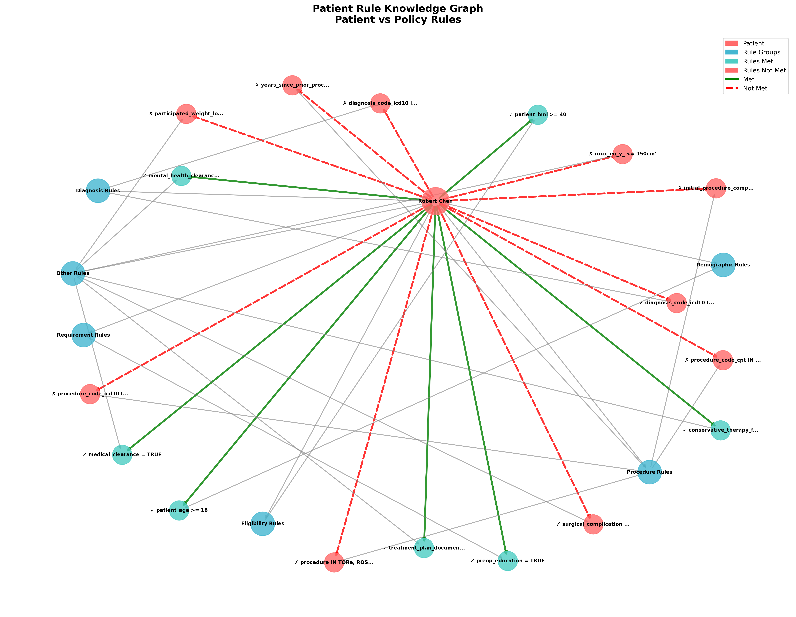

# Medical Policy Knowledge Graph Generator

A Python toolkit for generating and visualizing knowledge graphs from medical policies and patient data. This project focuses on bariatric surgery policies and creates visualizations to understand complex medical decision rules.

## 📁 Project Structure

```
├── generate_kg.py              # Main knowledge graph generator from SQL policies
├── patient_kg.py               # Patient data knowledge graph visualizer
├── patient_rule_kg.py          # Patient vs policy rule evaluator
├── generate_policy_rule_kg.py  # Policy rule knowledge graph generator
├── test1/                      # Example data and outputs
│   ├── Patient_Record.json     # Sample patient data
│   ├── Patient_data_dictionary.json  # Patient data schema
│   ├── SQL_CGSURG83.txt       # Sample SQL policy
│   ├── Data_dictionary_CGSURG83.json  # Field definitions
│   ├── Policy_CGSURG83.json   # Structured policy rules
│   ├── patient_kg_spring_15x10.png    # Generated patient KG
│   ├── patient_rule_kg.png            # Generated patient rule KG
│   └── policy_rule_kg.png             # Generated policy rule KG
├── scripts/                    # Shell scripts for easy execution
└── requirements.txt            # Python dependencies
```

## 🐍 Python Files

### 1. `generate_kg.py`
Main knowledge graph generator that converts SQL-based medical policies into structured knowledge graphs.

**Features:**
- Parses complex SQL WHERE clauses
- Extracts logical operators (AND, OR) and conditions
- Maps medical codes to descriptions
- Supports patient data integration
- Multiple visualization layouts

**Usage:**
```bash
python generate_kg.py --sql test1/SQL_CGSURG83.txt --codes test1/Data_dictionary_CGSURG83.json --plot-path policy_kg.png --show-plot
```

### 2. `patient_kg.py`
Creates knowledge graphs from patient data in various JSON formats.

**Features:**
- Auto-detects data structure (patient records, policies, data dictionaries)
- Multiple visualization layouts (spring, circular, hierarchical)
- Interactive Plotly visualizations
- Color-coded node types

**Usage:**
```bash
python patient_kg.py test1/Patient_Record.json --layout spring --figsize 15 10
```

### 3. `patient_rule_kg.py`
Evaluates patient data against policy rules and visualizes compliance.

**Features:**
- Parses SQL conditions into evaluable rules
- Compares patient data against policy criteria
- Color-codes met/unmet conditions
- Detailed evaluation summary

**Usage:**
```bash
python patient_rule_kg.py test1/Patient_Record.json test1/SQL_CGSURG83.txt test1/Data_dictionary_CGSURG83.json --figsize 16 12
```

### 4. `generate_policy_rule_kg.py`
Creates knowledge graphs focused on policy rule structure.

**Features:**
- Groups conditions by category (demographics, eligibility, requirements)
- Hierarchical rule organization
- Policy-centered visualization
- JSON export for further analysis

**Usage:**
```bash
python generate_policy_rule_kg.py --sql test1/SQL_CGSURG83.txt --data-dict test1/Data_dictionary_CGSURG83.json --plot-path policy_rules.png
```

## 📊 Example: Bariatric Surgery Policy Analysis (test1/)

The `test1/` directory contains a complete example analyzing bariatric surgery eligibility criteria.

### Input Data Files

1. **Patient Record** (`Patient_Record.json`):
   - Complete patient profile: 44-year-old male (Robert Chen)
   - BMI: 40.8, with diabetes and hypertension
   - Medical history, medications, and assessment plan

2. **SQL Policy** (`SQL_CGSURG83.txt`):
   - Complex eligibility criteria for bariatric surgery
   - BMI requirements (≥40 or ≥35 with comorbidities)
   - Program requirements and procedural codes

3. **Data Dictionary** (`Data_dictionary_CGSURG83.json`):
   - Field definitions for all policy variables
   - Organized by sections: Demographics, Eligibility, Program Requirements, etc.

4. **Policy Rules** (`Policy_CGSURG83.json`):
   - Structured representation of policy restrictions
   - Machine-readable format for rule evaluation

### Generated Knowledge Graph Visualizations

The example generates three main types of knowledge graphs:

#### 1. Patient Knowledge Graph (`patient_kg_spring_15x10.png`)
Shows the patient data structure with:
- Patient information at the center
- Medical conditions, vital signs, and medications as connected nodes
- Color-coded by data type (demographics, medical conditions, etc.)



#### 2. Policy Rule Graph (`policy_rule_kg.png`)
Displays the policy rule structure:
- Policy at the center
- Rule groups organized by category
- Individual conditions and their relationships
- Hierarchical organization of eligibility criteria



#### 3. Patient Rule Evaluation (`patient_rule_kg.png`)
Evaluates how the patient measures against policy criteria:
- Patient at the center
- Policy rules grouped by category (demographics, eligibility, requirements)
- Green edges for met conditions, red edges for unmet conditions
- Visual compliance dashboard



### Running the Example

To generate all visualizations for the test1 example:

```bash
# 1. Generate patient knowledge graph
python patient_kg.py test1/Patient_Record.json --layout spring --figsize 15 10

# 2. Evaluate patient against policy rules
python patient_rule_kg.py test1/Patient_Record.json test1/SQL_CGSURG83.txt test1/Data_dictionary_CGSURG83.json --figsize 16 12

# 3. Generate policy rule graph
python generate_policy_rule_kg.py --sql test1/SQL_CGSURG83.txt --data-dict test1/Data_dictionary_CGSURG83.json --plot-path test1/policy_rule_kg.png
```

## 🚀 Quick Start

1. Install dependencies:
```bash
pip install -r requirements.txt
```

2. Run the test1 example:
```bash
cd test1
python ../patient_kg.py Patient_Record.json
python ../patient_rule_kg.py Patient_Record.json SQL_CGSURG83.txt Data_dictionary_CGSURG83.json
python ../generate_policy_rule_kg.py --sql SQL_CGSURG83.txt --data-dict Data_dictionary_CGSURG83.json
```

## 🎨 Color Coding

- **Patient Nodes**: Red
- **Policy Nodes**: Teal  
- **Met Conditions**: Green
- **Unmet Conditions**: Red
- **Rule Groups**: Blue
- **Data Fields**: Mint
